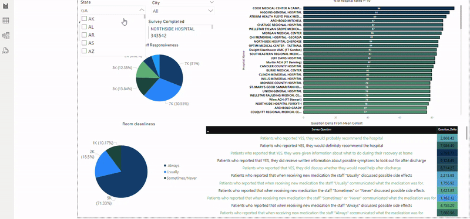

# Overview

A good hospital plays a critical role in ensuring the health and well-being of individuals and communities. Key attributes of a quality hospital include exceptional patient care, cleanliness, efficient communication, timely services, and high patient satisfaction levels. This project highlights these factors through a hospital recommendation dashboard, offering insights into what makes a hospital stand out.

## Key Metrics in a Good Hospital

1. **Cleanliness:** Ensuring a hygienic environment for patients and visitors.
2. **Communication:** Clear and effective communication between healthcare providers and patients.
3. **Timeliness of Care:** Quick response times for emergencies and routine visits.
4. **Satisfaction Scores:** Overall ratings based on patient feedback.
5. **Referral Effectiveness:** Smooth referral processes between departments and specialists.

## Technologies Used

- **Visualization Tools:** Power BI, Tableau
- **Programming Languages:** Python (for data preprocessing)
- **Libraries:** pandas, numpy, matplotlib

## Interactive Walkthrough

This README highlights the importance of hospital quality and outlines the technologies used to create an interactive dashboard for hospital recommendations.
